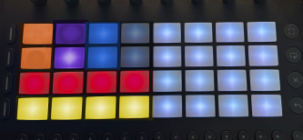

# Schwung Chord Garden

A MIDI FX Overtake module for the Schwung framework, inspired by the Telepathic Instruments Orchard device.

> [!NOTE]
> Chord Garden is an independent project developed from scratch for the Schwung/Move community. It is a tribute to the workflow of the Orchid by Telepathic Instruments. This project contains no proprietary code or assets from Telepathic Instruments and is not affiliated with them.

## Layout

### Color Guide
- **Orange**: Octave Up/Down (Column 0, Rows 2 & 3)
- **Indigo**: Inversion Up/Down (Column 1, Rows 2 & 3)
- **Blue**: Bass Octave Up/Down (Column 2, Rows 2 & 3)
- **Red**: Primary Chord Choice (Row 1, Cols 0-3)
- **Yellow**: Chord Extender (Row 0, Cols 0-3)
- **White**: Chromatic Note triggers (Right 4x4 grid)
- **Gray**: Dimmed, reserved for future use

## Installation
(TBD)
